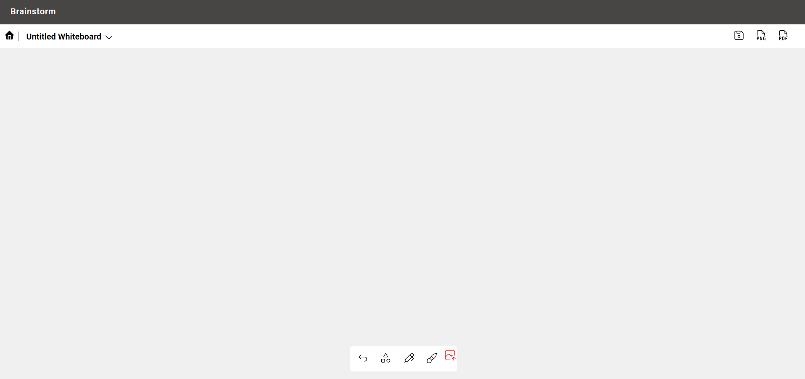
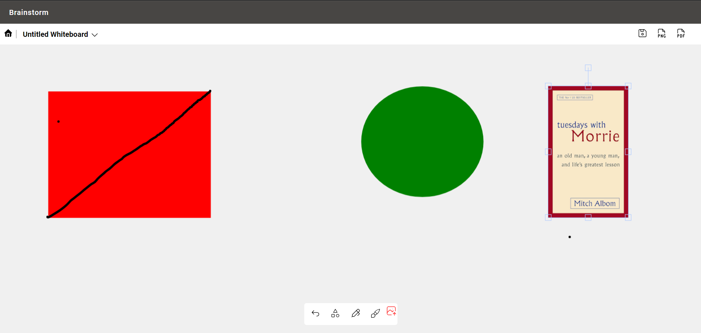

# Brainstorm

Brainstorm is a mern stack web-based application that enables real-time collaboration through a shared digital whiteboard.

## Features

- Whiteboard Creation and Joining: Users can create new whiteboard sessions or join existing ones.
- Drawing Tools: Draw on the whiteboard using customizable colors and brush sizes.
- Undo/Redo: Undo and redo drawing actions for flexibility and error correction.
- Real-time Collaboration: See the cursors of other users in real-time as they interact with the whiteboard.
- Image/PDF Export: Save the whiteboard content as an image (PNG or JPEG) or a PDF document.
- Secure Authentication: User signup and login functionality managed by Keycloak for secure access control.
- Responsive Design: The application adapts to different screen sizes and works seamlessly on desktop and mobile devices.

## Technologies

### Frontend:

- React (TypeScript)
- Bootstrap 5.0
- Fabric.js (for drawing functionality)
- keycloak.js

### Backend:

- Node.js (TypeScript)
- Express.js
- Keycloak (Dockerized)

## Getting Started

### Prerequisites

- Node.js (version 14 or newer)
- npm
- docker

### Installation

1. Run the following command to start Keycloak and MongoDB using Docker Compose:

   ```sh
   docker-compose up
   ```

2. After the containers are up and running, execute the [script.sh](https://github.com/Adarshkumar03/collab-whiteboard/blob/main/script.sh) script to start the frontend and backend:

   ```sh
   ./script.sh
   ```

   This script installs the necessary dependencies and starts the frontend and backend servers.

3. Access the Flybooker application by opening your web browser and navigating to [http://localhost:5173](http://localhost:5173).

## Screenshots

### Home Page



### Whiteboard Tool



### Login Page


### Register Page


