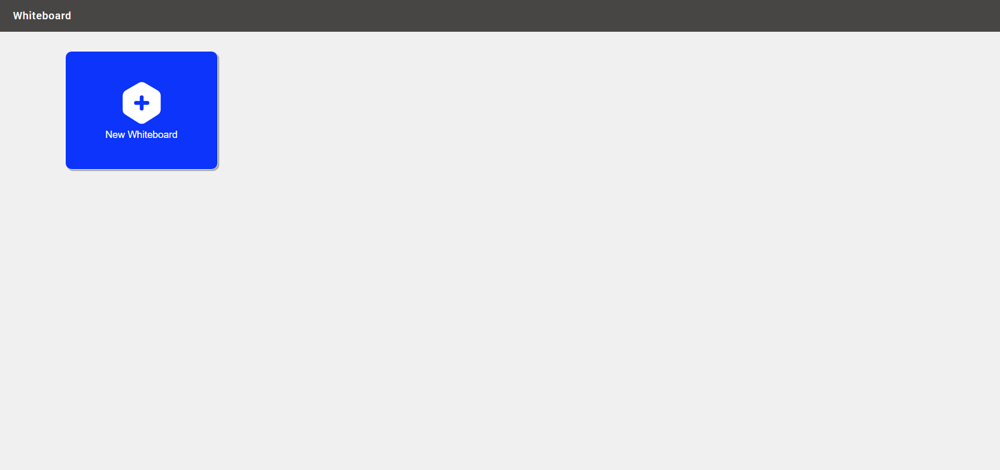
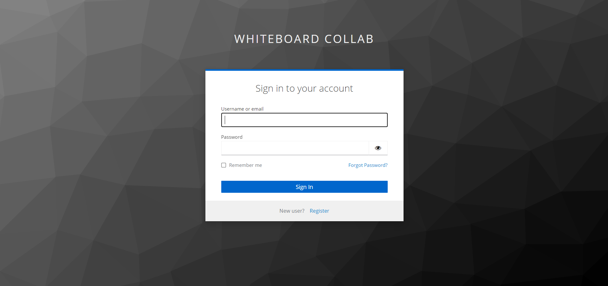
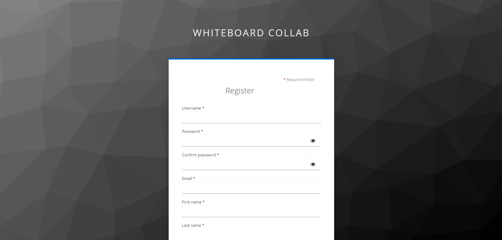
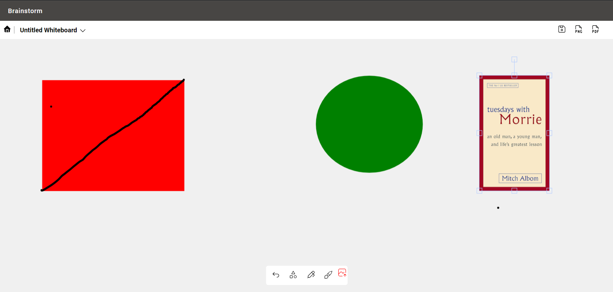

# Collab Whiteboard

A web-based application that enables real-time collaboration through a shared digital whiteboard.

## Features

- Whiteboard Creation and Joining: Users can create new whiteboard sessions or join existing ones.
- Drawing Tools: Draw on the whiteboard using customizable colors and brush sizes.
- Undo/Redo: Undo and redo drawing actions for flexibility and error correction.
- Real-time Collaboration: See the cursors of other users in real-time as they interact with the whiteboard.
- Image/PDF Export: Save the whiteboard content as an image (PNG or JPEG) or a PDF document.
- Secure Authentication: User signup and login functionality managed by Keycloak for secure access control.
- Responsive Design: The application adapts to different screen sizes and works seamlessly on desktop and mobile devices.

## Technologies

### Frontend:

- React (TypeScript)
- Bootstrap 5.0
- Fabric.js (for drawing functionality)
- WebSocket (for real-time updates)
- keycloak.js

### Backend:

- Node.js
- Express.js
- Socket.IO
- Keycloak (Dockerized)

## Getting Started

### Prerequisites

- Node.js (version 14 or newer)
- npm
- keycloak (dockerized)

### Installation

1.  Clone this repository: `git clone https://github.com/Adarshkumar03/collab-whiteboard.git`
2.  Navigate to collabe-whiteboard: `cd collab-whiteboard`
3.  Install Dependencies: `npm install`

### Development Mode

1. Enter the following code to start Keycloak
   `docker run -p 8080:8080 -e KEYCLOAK_ADMIN=admin -e KEYCLOAK_ADMIN_PASSWORD=admin quay.io/keycloak/keycloak:24.0.3 start-dev`
2. Login in to the Admin Console
3. Create a realme
4. Create a client inside realme
5. make an .env file that has following
   `VITE_KEYCLOAK_URL=your_host_post`
   `VITE_KEYCLOAK_REALM=your_realme_name`
   `VITE_KEYCLOAK_CLIENT=your_client_name`
6. Start the Vite develpment server: `npm run dev`
7. Start the backend server: `npm start`

### Production Build (frontend)

1. Create an optimized build: `npm run build`
2. The `dist` folder produced by the build process contains static files. Deploy these to your preferred web hosting platform.

## Screenshots

### Home Page

### Login Page

### Register Page

### Whiteboard Tool

